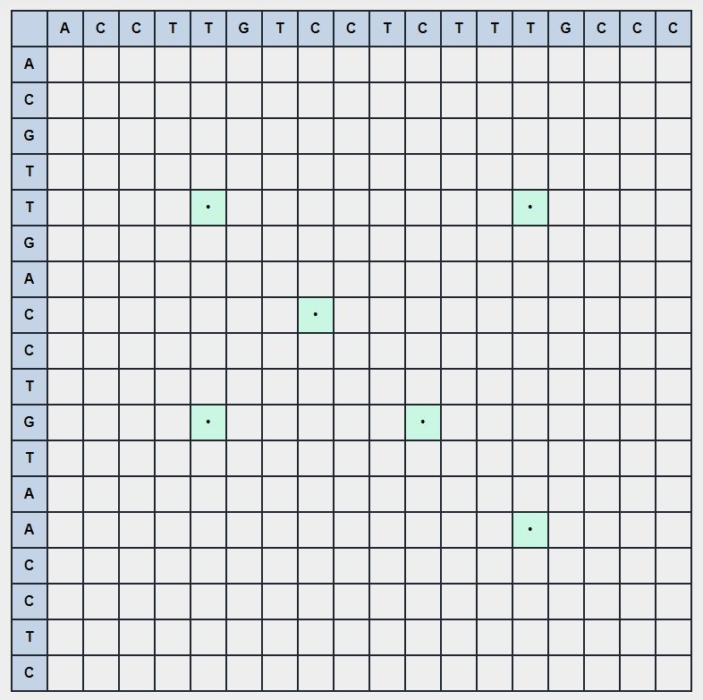

# BioInformatics Alignment Algorithms  Visualizatoin

live Version [here](https://bio-alignment-algos.netlify.app/)

## Built with
Html/CSS/JS

## Implemented Algorithms

-   Needleman Wunsch
-   Smith &amp; Waterman
-   Dot plot Matrix with window

# Test cases and Examples

## Needleman Wunsch

## Smith Waterman

## Dot plot matrix with window

